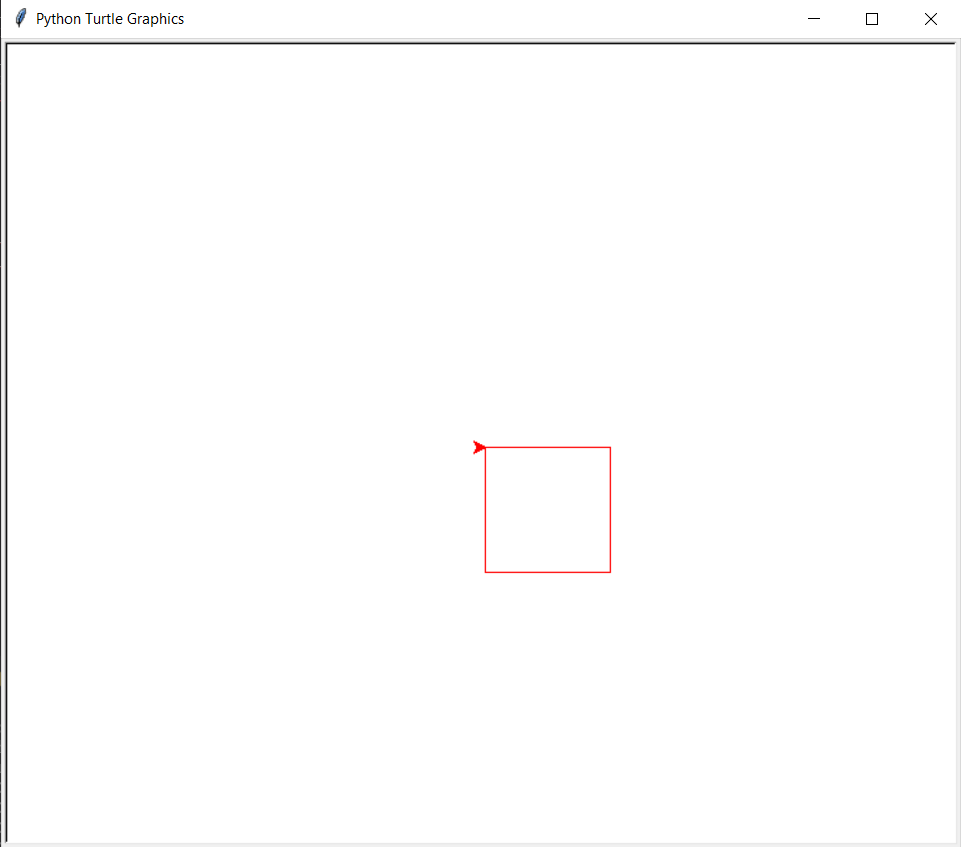
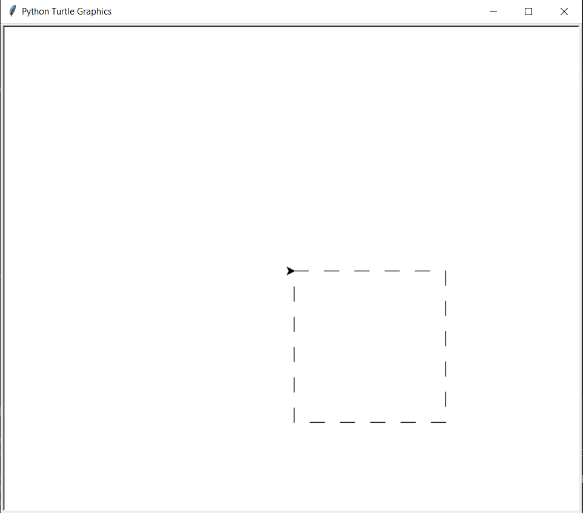
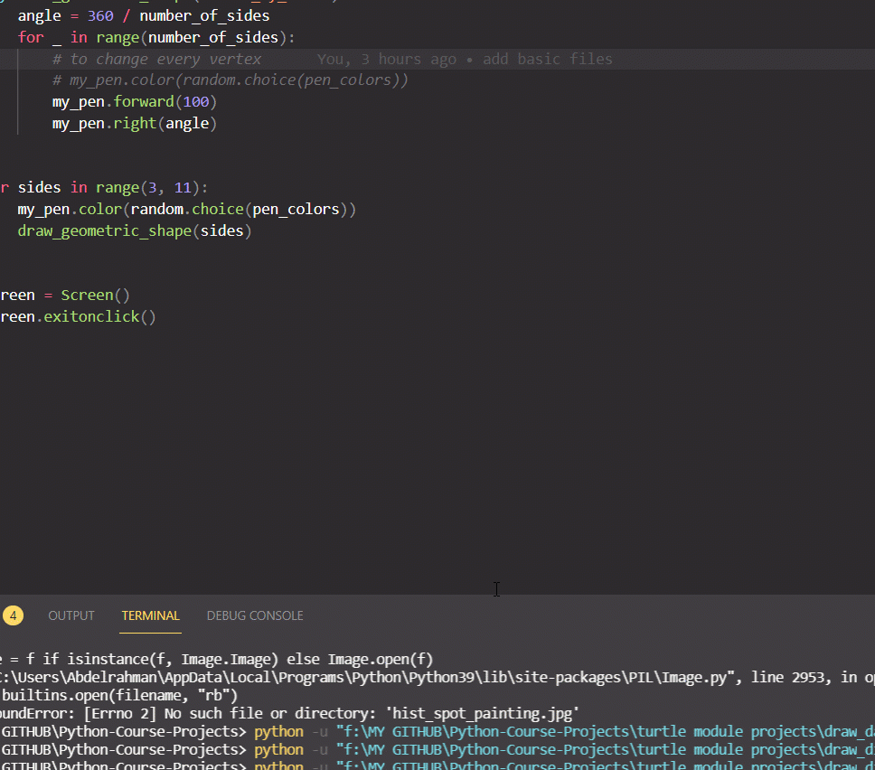
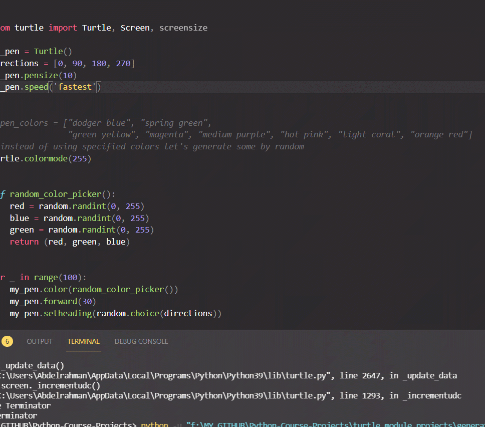
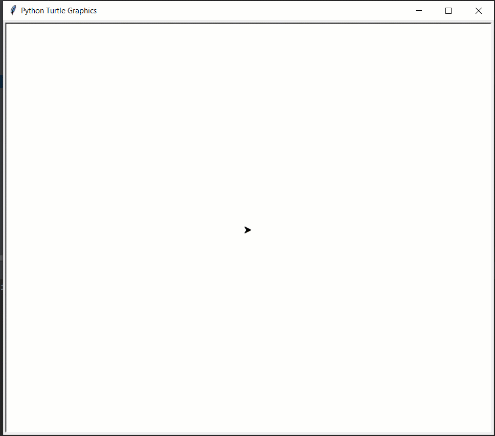

# Python-Course-Projects

# Using Turtle Model To make some graphics

### First, started by drawing basic lines and shapes

> Solid Square: 

> Dashed Square: 

### Then, moving up with higher graphics with animators:

> Different Geometric Shapes:

> randow walk:

> hist spot painting:

